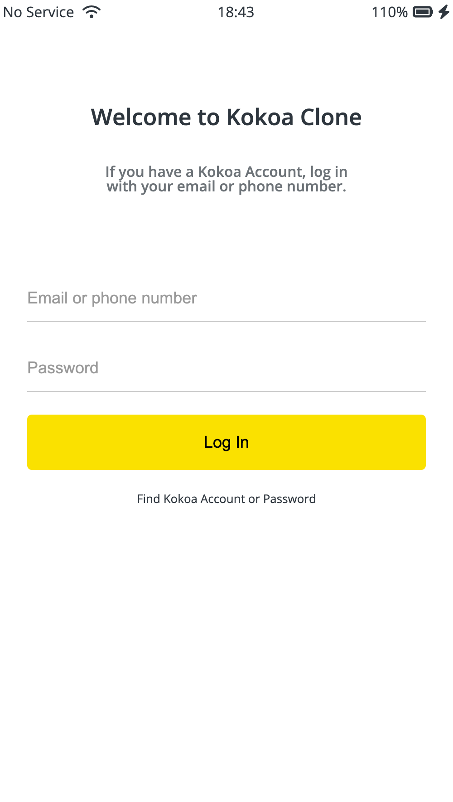
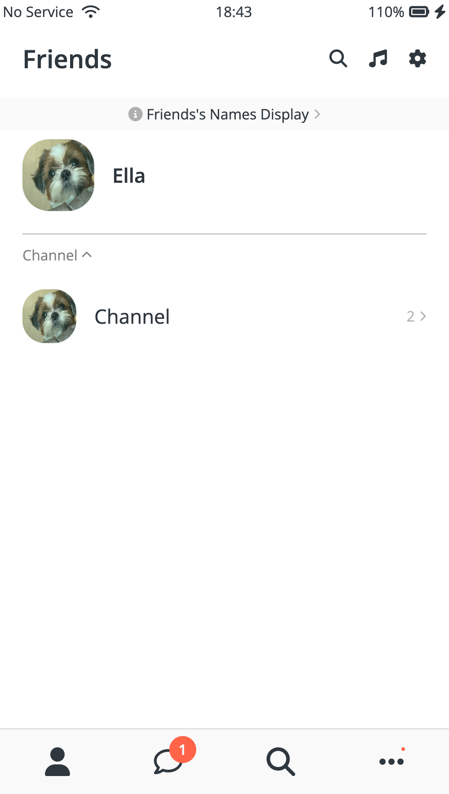
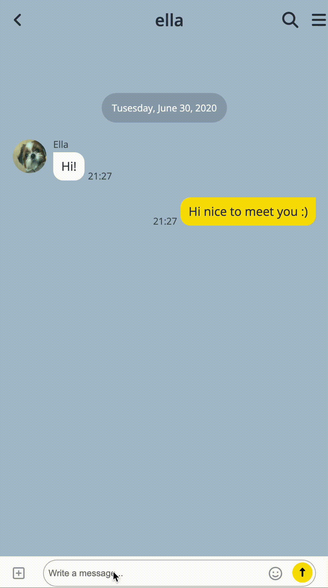
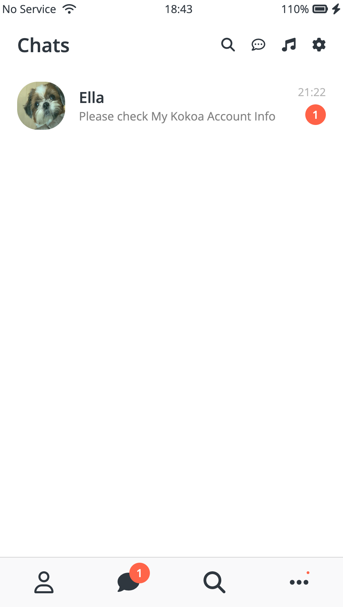
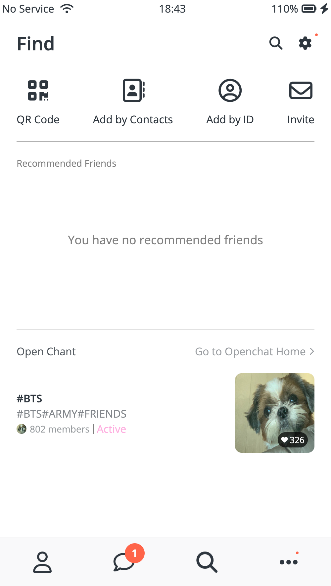
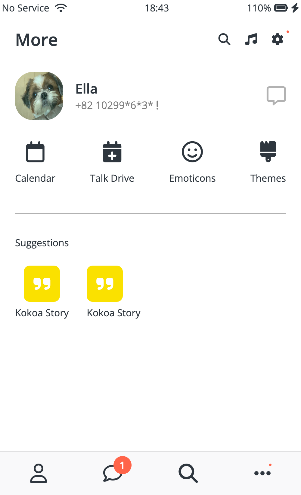

<p align='center'>

</p>

<p align='center'>📌 Introduction  
<p align='center'>새로운 기술과 빠르게 변하는 웹개발 트랜드 속에서,
<p align='center'>사용자 입장을 고려하기 위해 새로운 기술과 트렌드를 익혀 꾸준히 성장하기 위해 노력하는 프론트엔드 개발자 장정은 입니다.  </p>

# JUNGEUN JANG

## _📌 About Me_

- 생년월일 : 1996.02.27
- 이메일 : 3lla.jang@gmail.com
- 학력 : 연세대학교 미래캠퍼스 경제학과 졸업

## _📌 Skills_

- FrontEnd
  <p align="left">
      
        
      
       
      
  </p>
- BackEnd
  <p align="left">
       
      
      
      
  </p>
- Version Control
  <p align="left">
      
      
  </p>

  [](https://github.com/ellajang/github-readme-stats)

## _📌 Project Detail_

> Kokoa Talk App

- kakaotalk clone coding
  > Wetube Page
- Youtube clone coding
  > Nbnb Page
- Airbnb clone coding
  > Chrome APP
- Chrome page clone coding
  > Errand-App
- Side Project

## _📌 Project_

## [Kokoa Talk App](https://github.com/ellajang/202207_Kokoa_clone)










제작시기 : 2022.07

And of course Dillinger itself is open source with a [public repository][dill]
on GitHub.

## Installation

Dillinger requires [Node.js](https://nodejs.org/) v10+ to run.

Install the dependencies and devDependencies and start the server.

```sh
cd dillinger
npm i
node app
```

For production environments...

```sh
npm install --production
NODE_ENV=production node app
```

## Plugins

Dillinger is currently extended with the following plugins.
Instructions on how to use them in your own application are linked below.

| Plugin           | README                                    |
| ---------------- | ----------------------------------------- |
| Dropbox          | [plugins/dropbox/README.md][pldb]         |
| GitHub           | [plugins/github/README.md][plgh]          |
| Google Drive     | [plugins/googledrive/README.md][plgd]     |
| OneDrive         | [plugins/onedrive/README.md][plod]        |
| Medium           | [plugins/medium/README.md][plme]          |
| Google Analytics | [plugins/googleanalytics/README.md][plga] |

## Development

Want to contribute? Great!

Dillinger uses Gulp + Webpack for fast developing.
Make a change in your file and instantaneously see your updates!

Open your favorite Terminal and run these commands.

First Tab:

```sh
node app
```

Second Tab:

```sh
gulp watch
```

(optional) Third:

```sh
karma test
```

#### Building for source

For production release:

```sh
gulp build --prod
```

Generating pre-built zip archives for distribution:

```sh
gulp build dist --prod
```

## Docker

Dillinger is very easy to install and deploy in a Docker container.

By default, the Docker will expose port 8080, so change this within the
Dockerfile if necessary. When ready, simply use the Dockerfile to
build the image.

```sh
cd dillinger
docker build -t <youruser>/dillinger:${package.json.version} .
```

This will create the dillinger image and pull in the necessary dependencies.
Be sure to swap out `${package.json.version}` with the actual
version of Dillinger.

Once done, run the Docker image and map the port to whatever you wish on
your host. In this example, we simply map port 8000 of the host to
port 8080 of the Docker (or whatever port was exposed in the Dockerfile):

```sh
docker run -d -p 8000:8080 --restart=always --cap-add=SYS_ADMIN --name=dillinger <youruser>/dillinger:${package.json.version}
```

> Note: `--capt-add=SYS-ADMIN` is required for PDF rendering.

Verify the deployment by navigating to your server address in
your preferred browser.

```sh
127.0.0.1:8000
```

## License

MIT

**Free Software, Hell Yeah!**

[//]: # "These are reference links used in the body of this note and get stripped out when the markdown processor does its job. There is no need to format nicely because it shouldn't be seen. Thanks SO - http://stackoverflow.com/questions/4823468/store-comments-in-markdown-syntax"
[dill]: https://github.com/joemccann/dillinger
[git-repo-url]: https://github.com/joemccann/dillinger.git
[john gruber]: http://daringfireball.net
[df1]: http://daringfireball.net/projects/markdown/
[markdown-it]: https://github.com/markdown-it/markdown-it
[ace editor]: http://ace.ajax.org
[node.js]: http://nodejs.org
[twitter bootstrap]: http://twitter.github.com/bootstrap/
[jquery]: http://jquery.com
[@tjholowaychuk]: http://twitter.com/tjholowaychuk
[express]: http://expressjs.com
[angularjs]: http://angularjs.org
[gulp]: http://gulpjs.com
[pldb]: https://github.com/joemccann/dillinger/tree/master/plugins/dropbox/README.md
[plgh]: https://github.com/joemccann/dillinger/tree/master/plugins/github/README.md
[plgd]: https://github.com/joemccann/dillinger/tree/master/plugins/googledrive/README.md
[plod]: https://github.com/joemccann/dillinger/tree/master/plugins/onedrive/README.md
[plme]: https://github.com/joemccann/dillinger/tree/master/plugins/medium/README.md
[plga]: https://github.com/RahulHP/dillinger/blob/master/plugins/googleanalytics/README.md

<p align='center'>
  <a href="https://github.com/kyechan99/capsule-render/labels/Idea">
    
  </a>
  <a href="#demo">
    
  </a>
</p>
