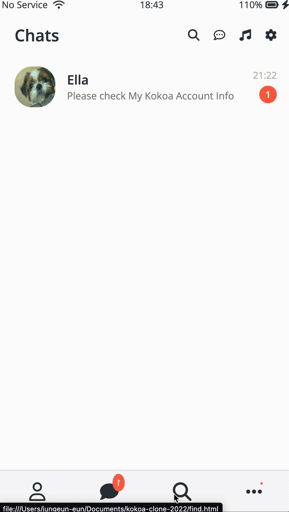
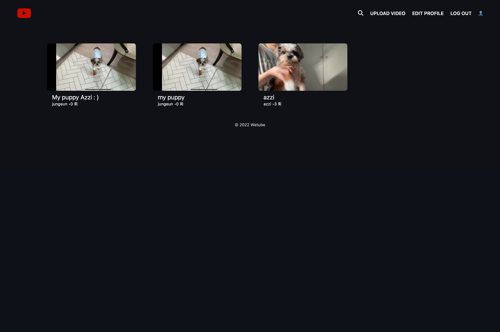
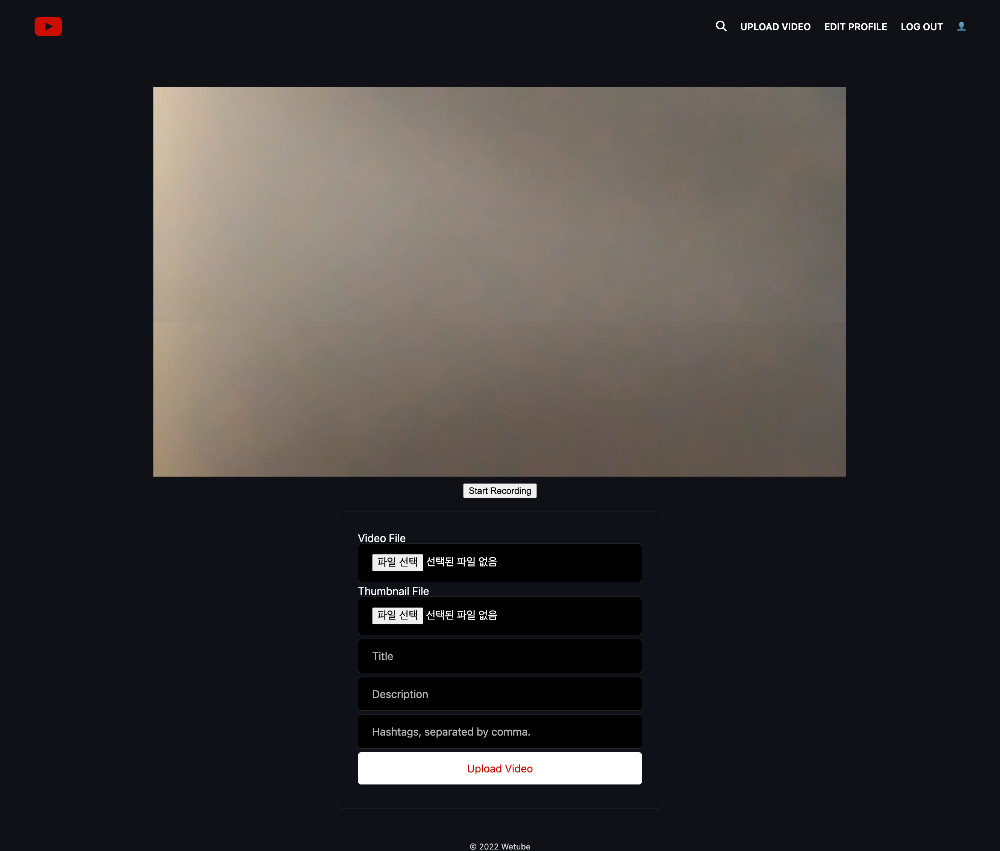
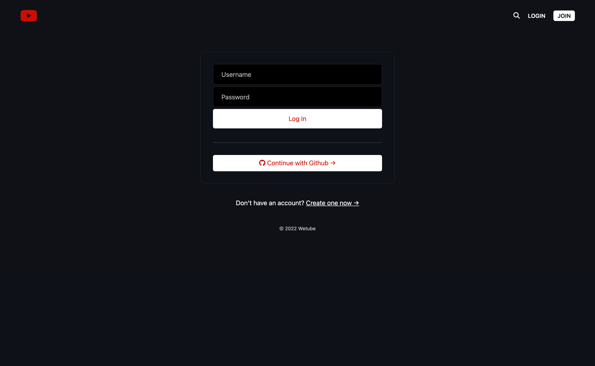
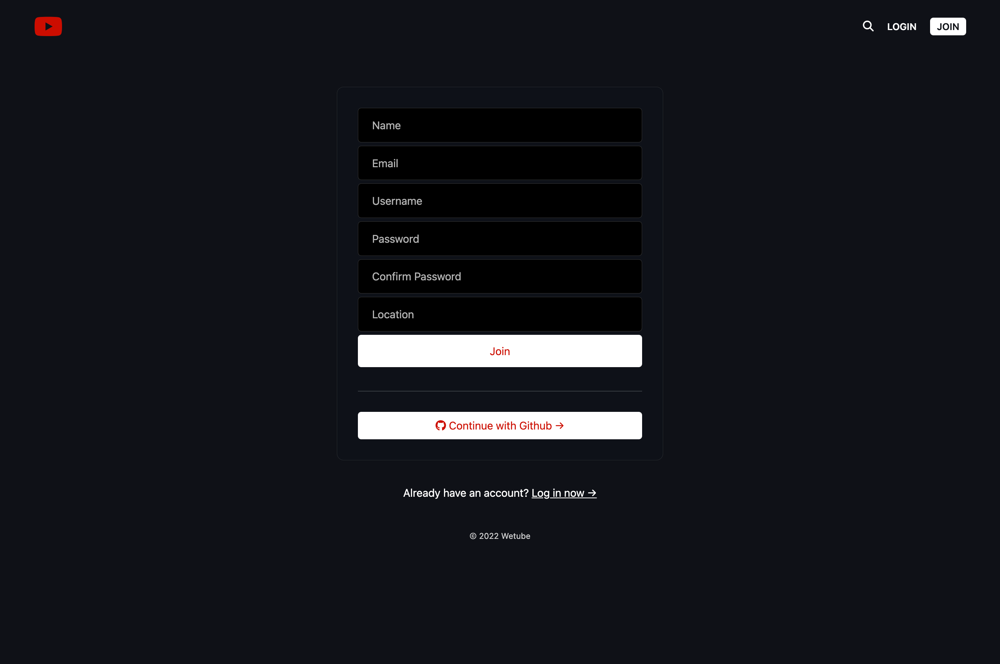
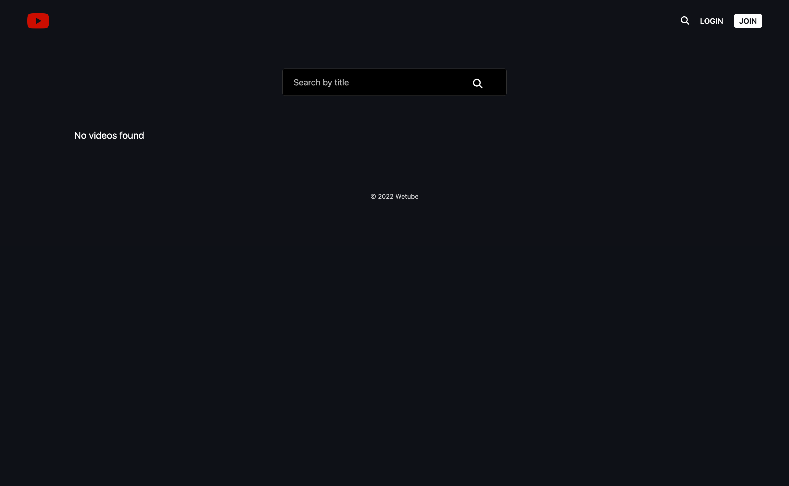

📌 Introduction  

새로운 기술과 빠르게 변하는 웹개발 트랜드 속에서,

사용자 입장을 고려하기 위해 새로운 기술과 트렌드를 익혀 꾸준히 성장하기 위해 노력하는 프론트엔드 개발자 장정은 입니다.  

# JUNGEUN JANG

## _📌 About Me_

- 생년월일 : 1996.02.27
- 이메일 : 3lla.jang@gmail.com
- 학력 : 연세대학교 미래캠퍼스 경제학과 졸업

## _📌 Skills_

- FrontEnd
  

      
       
      
       
      
      
  

- BackEnd
  

       
      
      
      
      
  

- Version Control
  

      
      
  

  

## _📌 Project_

> Kokoa Talk App

- kakaotalk clone coding
  > Wetube Page
- Youtube clone coding
  > Nbnb Page
- Airbnb clone coding
  > Chrome APP
- Chrome page clone coding
  > Errand-App
- Side Project

#

### _📌 Project Detail_

## [Kokoa Talk App](https://github.com/ellajang/202207_Kokoa_clone)

### _제작시기 : 2022.07_

### _사용 스택_

- `#Html` `#css`

### _주요기능 및 설명_

HTML. CSS를 활용하여 프론트엔드를 빌드하여 프로필, 채팅창 등 페이지를 구현하였으며, CSS를 활용하여 디자인과 애니메이션 효과를 입혔습니다.

#

## [Wetube Page](https://github.com/ellajang/202209_wetube-reloaded)

  

   

### _제작시기 : 2022.09_

### _사용 스택_

- `#Html,` `#Scss,` `#Pug,` `#JavaScript`

- `#NodeJS,` `#MongoDB,` `#Express`

### _주요기능 및 설명_

HTML. SCSS, PUG 그리고 약간의 바닐라JS를 활용하여 프론트엔드를 빌드하였습니다. Templete 엔진인 PUG를 활용하여 작성된 코딩을 HTML로 알맞게 바꿔주게 하였습니다. NodeJS, MongoDB, Express를 활용하여 백엔드를 구축하였습니다. 영상 재생, 댓글 달기, 동영상 검색을 할 수 있으며, 비디오를 녹화하고 업로드 할 수 있도록 했습니다. 로그인 페이지를 만들어 가입과 로그인을 가능하게 했으며, Github RestAPI를 이용하여 인증 및 로그인/로그아웃이 구현되게 했습니다.
